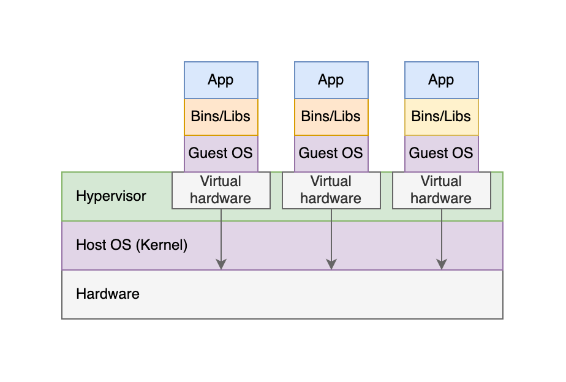
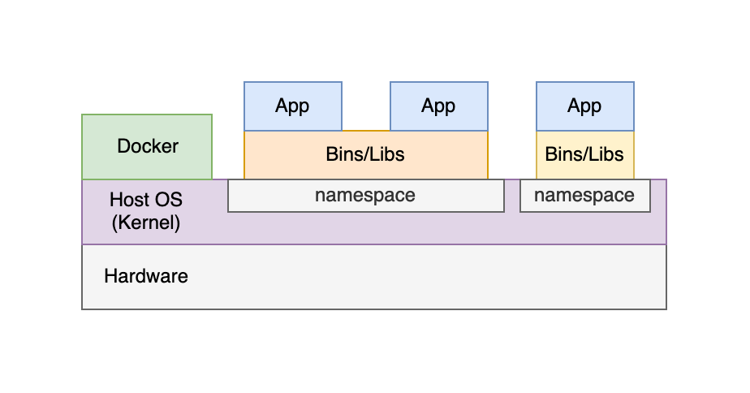
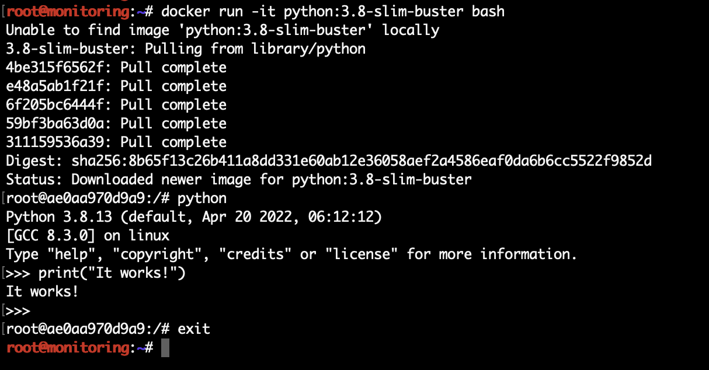
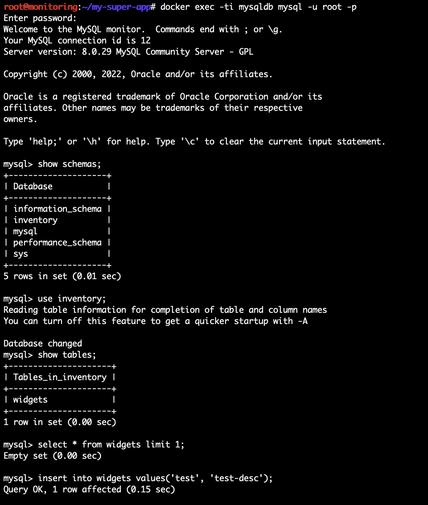
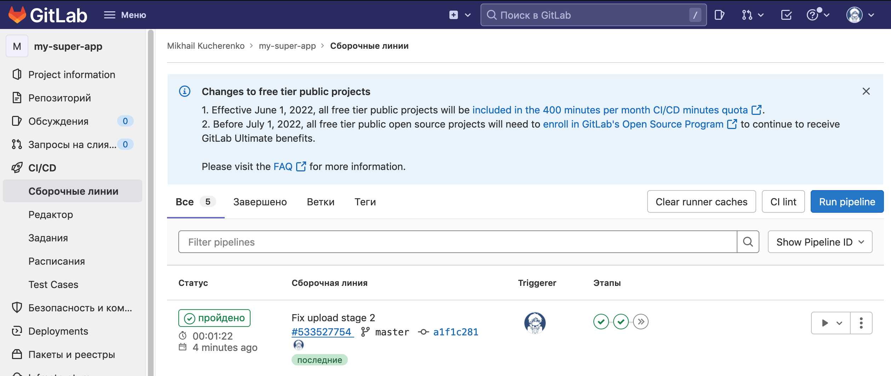
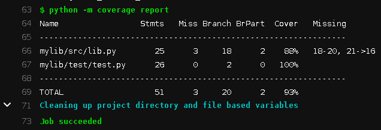
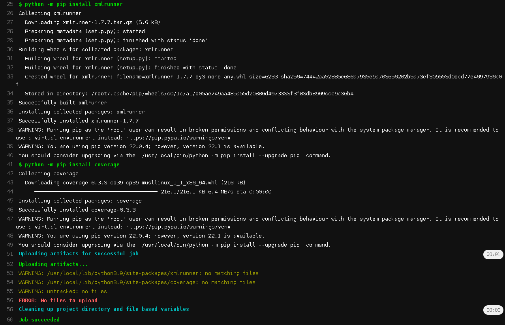
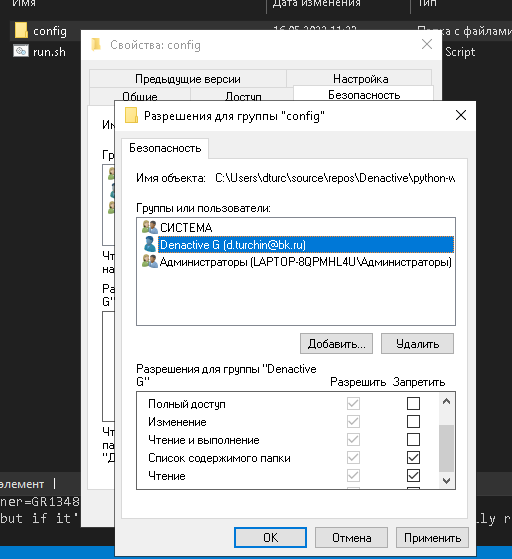

# Лабораторная работа №4. Docker & GitLab-CI.

**Что потребуется перед началом**:

- Виртуальная машина с установленной GNU/Linux.
- Базовые знания о работе GNU/Linux

**План и задачи лабораторной**:

1. Docker - установка, настройка, запуск контейнера
    - Установить и запустить Docker
    - Поднять готовый контейнер
    - Операции над контейнерами
    - Создание Dockerfile
    - Сборка своего контейнера
    - docker diff
2. GitLab-CI - зачем нужно, настройка, gitlab-runner, написание своего pipeline
    - Регистрация в bmstu.codes, анализ уже готового CI/CD процесса
    - Запуск gitlub-runner-а
    - Добавить в репозиторий .gitlab-ci.yml
    - Продемонстрировать работу автоматизации развертывания

**Отчет** - в любом читаемом формате (pdf, md, doc, docx, pages).

Обязательное содержимое отчета:

0. Фамилия и инициалы студента, номер группы, номер варианта
1. План и задачи лабораторной
2. Часть 1 - кратко описать, что было сделано
3. Часть 2 - кратко описать, что было сделано 
4. Приложить очищенный вывод `history` выполненных команд
5. [Универсальный вывод по лабораторной работе]


## Введение

Итак, мы шли к этому моменту целый семестр. DevOps!

> Для общего понимания принципов и философии DevOps можно послушать две моих презентации “Думай как SRE” и “Философия DevOps”. В рамках курса упор делается на практику и технологии, а не на подходы к разработке и построению рабочих процессов.

И для начала - неплохо бы разобраться, а вообще зачем нам это все? 

Ответ прост: разработчикам понадобилось разделять ресурсы одного мощного сервера на несколько независимых друг от друга окружений. По различным причинам - доступы, разные версии ПО, разные требования к ресурсам. И для этого есть масса инструментов, например, venv в python. Что совершенно не дает изоляции на уровне процессов. Это плохо. Как поддерживать много отдельных сайтов разных клиентов на одном сервере? Они ведь смогут пролезть друг к другу и украсть чужие данные. А еще неплохо бы дать возможность одному клиенту использовать Debian, другому - Centos, а третьему вообще Windows.

Отличная новость: для этого есть решение - виртуализация. Давайте внутри одной операционной системы (основной, “хостовой”) запустим другую (гостевая), пусть основная прикидывается аппаратным обеспечением. ПО, которое позволяет запустить ОС внутри ОС называют гипервизор (hypervisor), например, VirtualBox, VMWare или QEMU-KVM. Вот у нас и полная изоляция (ОС же разные) и разделение окружений (отдельная файловая система) и даже есть возможность прикидываться другой архитектурой процессора (транслируем команды одной архитектуры в другую на уровне хостовой ОС). Такой подход называется эмуляцией. Но у него есть серьезная проблема - получаем огромные накладные расходы на трансляцию команд. Вместо этого, давайте дадим доступ к аппаратному обеспечению напрямую (пусть и ограниченно) для гостевой ОС. Так мы частично потеряем возможность прикидываться другой архитектурой, но придется смириться с этой потерей ради повышения производительности. А еще наше аппаратное обеспечение должно уметь такую виртуализацию поддерживать, из-за чего такой подход называют аппаратной виртуализацией.

Но увы, наше ПО все еще работает медленнее, чем на системе без виртуализации. И эта разница может быть очень значительной. Что же мешает работать быстрее? Взглянем на схему работы  аппаратной виртуализации.



Как это можно оптимизировать? Очевидно, выбросить саму прослойку в виде гостевой ОС. У нас уже есть ядро основной ОС и оно может обрабатывать запросы от приложений. И по принципу бритвы Оккама еще неплохо бы не множить сущности без необходимости, т.е. как-то объединить похожие окружения. Получаем контейнерную виртуализацию - наши процессы исполняются на ядре основной ОС, а мы лишь пытаемся изолировать их друг от друга.



Работает это за счет механизмов linux-namespace, vfs, cgroups, capabilities, netfilter и так далее, часть из которых мы изучали в текущем курсе лабораторных.

Но тут же возникает вопрос, каким образом тогда Docker работает на Windows или MacOS? Ведь сборки есть и они работают. Что ж, тут тоже все просто. Он не работает. На других ОС приложение Docker запускает леговесную виртуальную машину с ядром Linux, поверх которой уже работает все остальное. Костыли.


Таким образом, контейнер - это набор изоляций для процессов, работающий поверх нашего ядра Linux. А сеть для него настраивается правилами netfilter. Никакой магии.


## Часть 1.

Устанавливаем Docker по [документации](https://docs.docker.com/engine/install/debian/).

```bash
# Качаем ключ
curl -fsSL https://download.docker.com/linux/debian/gpg | sudo gpg --dearmor -o /usr/share/keyrings/docker-archive-keyring.gpg

# Добавляем репозиторий
echo \
  "deb [arch=$(dpkg --print-architecture) signed-by=/usr/share/keyrings/docker-archive-keyring.gpg] https://download.docker.com/linux/debian \
  $(lsb_release -cs) stable" | sudo tee /etc/apt/sources.list.d/docker.list > /dev/null
  
# Ставим
sudo apt update
sudo apt install docker-ce docker-ce-cli containerd.io docker-compose-plugin
```

> Нужно обязательно обновить apt cache (`apt update`) после добавления нового репозитория.

Проверяем:

```bash
sudo docker run hello-world
```


> Стоит ознакомиться с предлагаемыми возможностями и руководствами

Теперь нам предстоит запустить свой первый настоящий контейнер (помимо hello-world), с python на борту.

```bash
sudo docker run -it python:3.8-slim-buster bash
```



Смотрим список образов:

```bash
sudo docker image ls
```

Смотрим список запущенных контейнеров (пуст):

```bash
sudo docker ps
```

Смотрим список всех контейнеров (2 завершенных):

```bash
sudo docker ps --all
```


Образ можно представить себе как набор расширений вокруг некого базового образа:


Каждая следующая “обертка” добавляет какой-то функционал. И верхняя обертка, как правило, код или сборка нашего ПО. Соответственно контейнер это набор из образа и команды которая запускает определенное ПО из образа и выполняет определенную задачу. Как только команда, запустившая образ завешена - контейнер остановится. Так, в примере с python-образом я запустил контейнер с командой bash и когда интерпретатор завершился - остановился и контейнер.

Попытка запустить образ без опций (`docker run python:3.8-slim-buster`) в данном случае приводит к тому, что там запускается команда, зашитая в образ (python), интерпретатор без псевдотелетайпа завершается, контейнер останавливается.

> Лучше вспомнить про tmux сейчас

Теперь попробуем запустить что-то более осмысленное и не в интерактивном режиме:

```bash
sudo docker run python:3.8-slim-buster python3 -m http.server 8000
```

В соседней консоли видим запущенный контейнер:

```bash
sudo docker ps
```


Однако `netstat -nlpt | grep 8000` не покажет ни одного приложения, слушающего 8000 порт. Это из-за изоляции. Контейнер имеет свой собственный сетевое пространство имен. Вот там этот порт слушается. Проверим, подключившись внутрь контейнера с помощью `docker exec`:

```bash
sudo docker exec -it 3ee16e5e9686 bash
```

Внутри самый обычный linux, в данном случае debian-дистрибутив. Поставим руками net-tools и проверим 8000 порт:


Слушается. Отлично. Теперь остановим наш контейнер. Это можно сделать нажав `^C` в консоли, где мы его запустили. Либо убив контейнер через docker:

```bash
sudo docker stop 3ee16e5e9686
```

Он пошлет сигнал SIGTERM процессу контейнера для завершения. Если тот не успеет завершиться за 10 секунд (настраивается ключом `-t`), то пошлет SIGKILL.

Но хотелось бы получить к нему доступ из нашей основной системы. Для этого нужно запустить контейнер с ключом `-p` + `-d` флаг для удобства (запустить в фоне, detached):

```bash
sudo docker run -dp 8080:8000 python:3.8-slim-buster python3 -m http.server 8000
```


Посмотрим логи контейнера за последние 120 секунд (пусты):

```bash
sudo docker logs --until=120s 51644b8cb1c5
```

Теперь соберем свой образ ([так](https://docs.docker.com/language/python/build-images/)). Для этого нам потребуется приложение (`app.py` + `requirements.txt`) и Dockerfile.

Файл `app.py` (вообще-то любое приложение):

```python
from flask import Flask
app = Flask(__name__)

@app.route('/')
def hello_world():
    return 'Hello, Docker!'
```

Файл ``requirements.txt``, можно сгенерировать `pip3 freeze > requirements.txt`:

```
Flask==2.1.2
```

Файл `Dockerfile`:

```dockerfile
# syntax=docker/dockerfile:1

FROM python:3.8-slim-buster

WORKDIR /app

COPY requirements.txt requirements.txt
RUN pip3 install -r requirements.txt

COPY . .

CMD [ "python3", "-m" , "flask", "run", "--host=0.0.0.0"]
```

Собираем:

```bash
sudo docker build --tag my-super-app .
```


Образа можно тэгать (именовать):

```bash
sudo docker tag my-super-app:latest my-super-app:v0.1.0
```

Можно удалять:

```bash
sudo docker rmi my-super-app:v0.1.0
```


Теперь запустим наш образ (можно добавить `--name ИМЯ` чтобы выбрать имя, иначе будет сгенерированное, в примере - great_turing):

```bash
sudo docker run -dp 8080:5000 my-super-app
```


Создадим сеть:

```bash
sudo docker network create mysqlnet
```

 Запустим в контейнере с отдельным диском MySQL:

```bash
sudo docker run --rm -d -v mysql:/var/lib/mysql \
  -v mysql_config:/etc/mysql -p 3306:3306 \
  --network mysqlnet \
  --name mysqldb \
  -e MYSQL_ROOT_PASSWORD=p@ssw0rd1 \
  mysql
```

Подключимся к базе для проверки:

```bash
sudo docker exec -ti mysqldb mysql -u root -p
```




Создадим более сложное приложение:

```python
import mysql.connector
import json
from flask import Flask

app = Flask(__name__)

db_host = "my-super-storage"
db_user = "root"
db_pass = "p@ssw0rd1"
db_name = "inventory"

@app.route('/')
def hello_world():
  return 'Hello, Docker!'

@app.route('/widgets')
def get_widgets():
  mydb = mysql.connector.connect(
    host=db_host,
    user=db_user,
    password=db_pass,
    database=db_name
  )
  cursor = mydb.cursor()


  cursor.execute("SELECT * FROM widgets")

  row_headers=[x[0] for x in cursor.description] #this will extract row headers

  results = cursor.fetchall()
  json_data=[]
  for result in results:
    json_data.append(dict(zip(row_headers,result)))

  cursor.close()

  return json.dumps(json_data)

@app.route('/initdb')
def db_init():
  mydb = mysql.connector.connect(
    host=db_host,
    user=db_user,
    password=db_pass
  )
  cursor = mydb.cursor()

  cursor.execute("DROP DATABASE IF EXISTS inventory")
  cursor.execute("CREATE DATABASE inventory")
  cursor.close()

  mydb = mysql.connector.connect(
    host=db_host,
    user=db_user,
    password=db_pass,
    database=db_name
  )
  cursor = mydb.cursor()

  cursor.execute("DROP TABLE IF EXISTS widgets")
  cursor.execute("CREATE TABLE widgets (name VARCHAR(255), description VARCHAR(255))")
  cursor.close()

  return 'init database'

if __name__ == "__main__":
  app.run(host ='0.0.0.0')
```

Не забудем обновить зависимости:

```bash
pip3 install mysql-connector-python
pip3 freeze | grep mysql-connector-python >> requirements.txt
```

Еще раз соберем образ:

> Более правильно будет использовать `docker buildx` для сборки под [мультиплатформу](https://www.docker.com/blog/multi-arch-images/)

```bash
sudo docker build --tag my-super-app .
```

Запустим:

```bash
sudo docker run \
  --rm -d \
  --network mysqlnet \
  --name rest-server \
  -p 8080:5000 \
  my-super-app
```

Проверим:

```bash
curl http://localhost:8080/initdb
curl http://localhost:8080/widgets
```

Можно узнать, что изменил локально конкретный контейнер от образа:

```bash
sudo docker diff rest-server
```

Остановим все принудительно:

```bash
sudo docker kill $(sudo docker ps -q)
```


 Не очень удобно каждый раз запускать все микросервисы вручную? Есть docker-compose.

```bash
sudo apt install docker-compose
```

Файл `docker-compose.yml`:

```yaml
version: '3.3'

services:
 my-super-app-api:
  build:
   context: .
  ports:
  - 8080:5000
  networks:
    my_super_net:

 my-super-storage:
  image: mysql
  ports:
  - 3306:3306
  environment:
  - MYSQL_ROOT_PASSWORD=p@ssw0rd1
  volumes:
  - mysql:/var/lib/mysql
  - mysql_config:/etc/mysql
  networks:
    my_super_net:

volumes:
  mysql:
  mysql_config:

# У меня просто сеть пересекается с дефолтной 172.X.Y.Z
networks:
  my_super_net:
    driver: bridge
    ipam:
      driver: default
      config:
        - 
          subnet: 192.168.2.0/24
```

> By default Compose sets up a single [network](https://docs.docker.com/engine/reference/commandline/network_create/) for your app. Each container for a service joins the default network and is both *reachable* by other containers on that network, and *discoverable* by them at a hostname identical to the container name.

Запустим - он сам соберет и запустит все, что нужно:

```bash
sudo docker-compose up -d

# Или более полно:
sudo docker-compose -f docker-compose.yml up --build -d
```

Остановить:

```bash
sudo docker-compose down
```

Удалить и volumes:

```bash
sudo docker-compose down -v
```


## Часть 2

Заходим в gitlab, создаем проект, смотрим в CI/CD раздел:


Запускаем у себя создание раннера:

```bash
sudo docker run -d -v /var/run/docker.sock:/var/run/docker.sock -v gitlab-runner-config:/etc/gitlab-runner gitlab/gitlab-runner:latest
```

Регистрируем:

```bash
sudo docker run --rm -it -v gitlab-runner-config:/etc/gitlab-runner gitlab/gitlab-runner:latest register --locked=false
```

Ждем, пока на странице раннеров он станет активен.


Пушим в репозиторий .gitlab-ci.yml:

```yaml
stages:
  - test
  - build
  - upload

run tests:
  image: python:3.8-slim-buster
  stage: test
  script:
    - python --version
    - echo "DONE!"

build image:
  image: docker:latest
  stage: build
  services:
    - docker:dind
  before_script:
    - docker login -u $CI_REGISTRY_USER -p $CI_REGISTRY_PASSWORD $CI_REGISTRY
  script:
    - docker build --pull -t $CI_REGISTRY_IMAGE .
    - echo $CI_REGISTRY_IMAGE
  only:
    - master

upload image:
  image: docker:latest
  stage: upload
  services:
    - docker:dind
  when: manual
  before_script:
    - docker login -u $CI_REGISTRY_USER -p $CI_REGISTRY_PASSWORD $CI_REGISTRY
  script:
    - docker build --pull -t $CI_REGISTRY_IMAGE .
    - echo $CI_REGISTRY_IMAGE
    - docker push $CI_REGISTRY_IMAGE
  only:
    - master
```



После выполнения ручного этапа должны увидеть в registry свой образ:


## Этапы жизненного цикла ПО (ЖЦ):
Вообще типичные пайплайны на работе:
1. test
   - тестирование кода
   - протестированный код передается далее как [артефакт](https://docs.gitlab.com/ee/ci/pipelines/job_artifacts.html)
2. build rpm
   - сборка rpm-пакетов. В debian это deb. В Ubuntu - apt
   - собирается docker-образ, передается дальше через registry
3. rsync rpm to repo-server
   - ручная фаза копирования изменений на *development* или *production*-сервер
   - Протокол scp. Scp это cp over ssh

[Этапы ЖЦ](https://docs.gitlab.com/ee/ci/yaml/#stages), выделяемые гитлаб.


# Extra задание с двумя звездочками

Материал разработан при содействии [студентов](https://gitlab.com/Denactive/education_devops_gitlabci).

## Содержание
+ Тестирование кода
+ Замер покрытия
+ Отображение тестов в pipeline
+ Артефакты
+ Дополнительно к дополнительному

## Тестирование кода
До сих пор пайплайн ничего не проверял. Напишем новый скрипт и код к нему.

Создадим папочки:

```
root
|
+ mylib/ -|
|        + src/ lib.py
|        + test/test.py
|
+ __init__.py
+ .gitignore
```

`mylib/src/lib.py`
```python
def merge(*arrays):
  '''
  Эта функция объединяет элементы массивы вида list<tuple<str, int>>
  в словарь dict<str, int>. Элементы будут расположены в том порядке, в они котором идут
  в исходных массивах, при этом на каждом шаге из первых элементов списков
  выбирается минимальный
  '''
  arrays = list(filter(lambda array: len(array), arrays))
  positions = [0]  * len(arrays)
  res = {}
  while sum(positions) != -len(arrays):
    column = [arrays[i][pos] for i, pos in enumerate(positions)]
    minimum = column[0][0]
    minimum_idxs = []
    minimum_num = 0
    for i, (el, num) in enumerate(column):
      if el < minimum:
        minimum = el
        minimum_num = num
        minimum_idxs = [i]
      elif el == minimum:
        minimum_num = minimum_num + num
        minimum_idxs.append(i)
      
    res[minimum] = (0 if not minimum in res else res[minimum]) + minimum_num
    for i in minimum_idxs:
      positions[i] = positions[i] + 1
    # удаляю с конца, чтобы не было проблем из-за смещения индексов
    for i in reversed(minimum_idxs):
      if positions[i] == len(arrays[i]):
        positions.pop(i)
        arrays.pop(i)
  return res

```

`mylib/test/test.py`
```python
import unittest

# Чтобы файл с тестами видел новый модуль
import sys
import os
# Получение пути текущей директории
current = os.path.dirname(os.path.realpath(__file__))
root = os.path.join(current, f'..{os.path.sep}..')
sys.path.append(root)
# Теперь можно импортировать наш модуль
from mylib.src.lib import merge

cases = [
  {
    'test': [[('hello', 1), ('hello1', 1)]],
    'answer': {'hello': 1, 'hello1': 1},
  },
  {
    'test': [[('hello', 1), ('hello', 1)]],
    'answer': {'hello': 2},
  },
]

class TestWordCount(unittest.TestCase):
  # Действия до запуска тестов
  def setUp(self):
    pass

  # Действия по окончании тестирования
  def tearDown(self):
    pass

  # Каждый тест должен начинаться с test_
  def test_merge(self):
    print('running test_merge...')
    for i, case in enumerate(cases):
      print('case', i + 1)
      self.assertDictEqual(merge(*case['test']), case['answer'])

if __name__ == "__main__":
  unittest.main()

```

`__init__.py`
```python
from .src.lib import merge
```

Добавим `.gitignore`, чтобы не спамить мусор
```
__pycache__/
```

Проверяем, что тест работает.
```bash
python ./mylib/test/test.py
```
```
Running tests...
----------------------------------------------------------------------
running test_merge...
case 1
case 2
...
----------------------------------------------------------------------
Ran 3 tests in 0.002s

OK
```

Перепишем `.gitlab-ci.yml`
```yaml
stages:
  - test


run tests:
  image: python:3.9.12-alpine3.15
  stage: test
  before_script:
  script:
    - echo "Testing"
    - python -m unittest discover ./mylib/test/

```

В этом пайплайне используется другой легковесный образ python:3.9.12-alpine3.15 с уже предустановленным питоном 3 и последним pip. Он весит 57 Мб против 900 у полного образа с питоном.

Команда `python -m unittest discover .\mylib\test\` используется для выполнения всех тестов в модуле.

Функция нашей библиотеки выполняет часть соединения массивов (step 4) в сортировке слиянием (merge sort):


## Замер покрытия

Добавим замер покрытия кода тестами.
Используем python утилиту [coverage](https://coverage.readthedocs.io/en/6.3.3/).

```bash
pip install coverage
```

После установки можно прогонять код вот так:
```bash
python -m coverage run file.py
```
для python-модулей:
```bash
python -m coverage run -m path.to.module
```
Более того, вместе с библиотекой ставится команда `coverage`, аналогичная `python -m coverage`

Замер покрытия генерирует в корне проекта файл `.coverage`. Добавим его в гитигнор.

После выполнения замера, можно вывести отчет на экран:

```bash
coverage report file.py
```

```
PS C:\ДЗ\DevOps\расширение для лаб-4> coverage report
Name                 Stmts   Miss  Cover
----------------------------------------
mylib\__init__.py        1      0   100%
mylib\src\lib.py        25      3    88%
mylib\test\test.py      29      0   100%
----------------------------------------
TOTAL                   55      3    95%

```
Однако он может содержать множество ненужных файлов, которые мы не собирались использовать. Чаще всего это различные `__init__.py` или чужие библиотеки. Настроить правила вывода отчета, игнорирование файлов и отдельных строк, путь, куда нужно положить отчет и многое другое можно в конфиге .coveragerc. Создадим его:

`.coveragerc`
```toml
[run]
relative_files = True
branch = True

[report]
omit =
    ./wordcounter/test/progress_bar.py
    ./wordcounter/test/cases_test_decorator.py
    ./wordcounter/test/test_cases/*
    ./**/__init__.py

exclude_lines =
    if __name__ == "__main__":
    unittest.main()
    pragma: no cover

show_missing = True
skip_empty = True
fail_under=90

```

Все его поля - это соответствующие опции команды coverage (см --help), только дефисы заменены нижними подчеркиваниями. Опция fail_under очень полезна для пайплайнов. Пайплайн не пройдет, если покрытие не будет достигать 90%. Запускаем `coverage run mylib/test/test.py`, `coverage report`

```
PS C:\ДЗ\DevOps\расширение для лаб-4> coverage report
Name                 Stmts   Miss Branch BrPart  Cover   Missing
----------------------------------------------------------------
mylib\src\lib.py        25      3     18      2    88%   18-20, 21->16
mylib\test\test.py      26      0      2      0   100%
----------------------------------------------------------------
TOTAL                   51      3     20      2    93%
```
Появилась дополнительная информация.

Отчеты так же можно выводить в .json, .xml и .html форматы.

Отправим все это на гитлаб. Перепишем `.gitlab-ci.yml`
```yaml
stages:
  - test


run tests:
  image: python:3.9.12-alpine3.15
  stage: test
  before_script:
    - python -m pip install coverage
  script:
    - echo "Testing & Coverage"
    - python -m coverage run ./mylib/test/test.py
    - python -m coverage report

```
На гитлаб увидим следующее:




## Отображение тестов в pipeline
В гитлаб есть поддержка тестов. Во время прохождения пайплайна, видно сколько тестов было пройдено, и какой текст выводился во время выполнения каждого из них. [Подробно с примерами для разных языков](https://docs.gitlab.com/ee/ci/unit_test_reports.html). Для этого нужно оформить отчет в виде .xml в формате [Jenkins JUnit](https://plugins.jenkins.io/junit/), и положить его в **корень!** как артефакт.

[Аналогично для покрытия](https://docs.gitlab.com/runner/development/reviewing-gitlab-runner.html#reviewing-tests-coverage-reports), но пока покрытие показывается только в UI merge-request.

Используемый нами фреймворк unittest не поддерживает junit формат (сейчас можете сохранить где-нибудь отчет `coverage xml`), поэтому для него есть расширение.
```bash
pip install xmlrunner
```
Существуют аналогичные расширения для [других языков](https://stackoverflow.com/questions/11241781 python-unittests-in-jenkins).

изменим `mylib/test/test.py`:

в начале:
```python
import unittest
import xmlrunner

```

Допишем еще бесполезных тестов:
```python
  def test_useless_1(self):
    print('running test_useless_1...')
    self.assertFalse(10 < 4)

  def test_useless_2(self):
    print('running test_useless_2...')
    self.assertFalse(10 < 4)

```

Заменим main внизу:
```python
if __name__ == "__main__":
  with open(XML_RESULT_FILE, mode='w', encoding='utf-8') as output:
    # да, эта штука пишет в открытый файл
    unittest.main(testRunner=xmlrunner.XMLTestRunner(output=output))

```

Про [with](https://pycoder.ru/python-with-statement/) и [этот модуль](https://github.com/xmlrunner/unittest-xml-reporting).

Добавим установку этого пакета и генерацию артефактов.
```yaml
stages:
  - test


run tests:
  image: python:3.9.12-alpine3.15
  stage: test
  before_script:
    - python -m pip install xmlrunner
    - python -m pip install coverage
  script:
    - echo "Testing & Coverage"
    - python -m coverage run ./mylib/test/test.py
    - python -m coverage report
    - python -m coverage xml
  artifacts:
    when: always
    reports:
      junit:
        - report.xml
      coverage_report:
        coverage_format: cobertura
        path: coverage.xml

```

Если тестировали все это локально перед пушем, что правильно, не забудьте дописать в `.gitignore`:
```
__pycache__/
.coverage
**/report.xml
**/coverage.xml

```

Что же изменилось? Открываем подробную информацию по пайплайн, вкладка **тесты**:


Самостоятельно попробуйте сломать какой-нибудь тест и посмотреть на результат.
Попробуйте повысить коэффициент покрытия, необходимый для прохождения, либо добавить код в библиотеку, который не будет выполняться: `if False:`.

## Артефакты
[Артефакт](https://docs.gitlab.com/ee/ci/pipelines/job_artifacts.html) - это файл, генерируемый джобой во время выполнения пайплайна. Его можно передавать другим джобам или сохранять в репозитории.

Передадим артефакт с результатами тестов от одной джобы к джобе, которая отправляет отчеты в какое-нибудь другое место.

```yaml
stages:
  - test
  - report


run tests:
  image: python:3.9.12-alpine3.15
  stage: test
  before_script:
    - python -m pip install xmlrunner
    - python -m pip install coverage
  script:
    - echo "Testing & Coverage"
    - python -m coverage run ./mylib/test/test.py > report.txt
    - echo -e "\n---------------\n" >> report.txt
    - python -m coverage report >> report.txt
  artifacts:
    paths:
      - report.txt
    untracked: true

send tests:
  stage: report
  script:
    - echo "Sending a report"
    - cat report.txt

```


Файл доступен внутри джобы с отчетами, иначе она бы упала:


**У артефактов не мало особенностей**

Не найденные артефакты **не ломают джобу**, пайплайн не падает:



Путь к артефактам может быть указан только **относительно рабочей директории пайплайна**. К сожалению, этого [не написано в доке](https://gitlab.com/gitlab-org/gitlab-foss/-/issues/15530). Путь к рабочей директории можно получить с помощью [предустановленной переменной $CI_PROJECT_DIR](https://docs.gitlab.com/ee/ci/variables/predefined_variables.html):

```pwd при старте = echo $CI_PROJECT_DIR при условии, что не задана builds_dir в конфиге раннера```

[Более подробно про передачу артефактов между джобами](https://stackoverflow.com/questions/38140996/how-can-i-pass-artifacts-to-another-stage).

Обратите внимание, **джобы выполняются последовательно**: артефакт, генерируемый одной джобой доступен только следующей. Если нужно, чтобы артефакт использовался спустя несколько джоб, то необходимо указать [dependencies](https://docs.gitlab.com/ee/ci/yaml/#dependencies), чтобы нарушить линейный порядок.


## Дополнительно
### Когда джоба падает?
Джоба падает, если хотя бы одна строчка скрипта вернула ReturnCode (коротко rc) ($? В баше) не ноль. rc можно подруливать самому, написав условия и обертку над командой. В posix - rc=0 считается однозначным критерием, что программы выполнилась корректно. К сожалению, не все соблюдают posix.

### Как передать пароли?
[Передача паролей, токенов и т.п. в GitLab-CI](https://parsiya.net/blog/2021-10-11-modify-gitlab-repositories-from-the-ci-pipeline/#future-work)

### Переменные
[Переменные: глобальные и локальные для джобов](https://docs.gitlab.com/ee/ci/variables/). Ниже есть пример.

### Передача готовых сборок между джобами
Установить пакеты в одной джобе и и передать их в другую не выйдет. Лучше воспользоваться registry. Докер удобнее тем, что ему не важно, по каким директориям apt-get или pip разбросал файлы. Настройка всего окружения с нуля - крайне сложное занятие ([пример того, как это делается в python:alpine](https://github.com/docker-library/python/blob/f871d0435e7f35a693fa1b60aa159e6a1a4c6a2e/3.9/alpine3.15/Dockerfile)). Докер позволяет всю эту свору команд превратить в одну строчку - image: ...
Передача артефактами удобна, когда нужно пробросить конфиги или отдельные собранные самописные библиотеки. Сделать это можно как-то так:
```yaml
variables:
  PYTHON_PIP_FOLDER: /usr/local/lib/python3.9/site-packages

build python:
  image: python:3.9.12-alpine3.15
  stage: build
  script:
    - echo "Python building"
    - python -m pip install xmlrunner
    - python -m pip install coverage
    - mkdir libs/
    - mv $PYTHON_PIP_FOLDER/xmlrunner libs/xmlrunner
    - mv $PYTHON_PIP_FOLDER/coverage libs/coverage
  artifacts:
    paths:
      - libs/
    untracked: true

run tests:
  image: python:3.9.12-alpine3.15
  stage: test
  dependencies: 
    - build python
  before_script:
    - mv libs/* $PYTHON_PIP_FOLDER/
  script:
    - echo "Testing & Coverage"
    - python -m coverage run ./wordcounter/test/test.py
    - python -m coverage report
    - python -m coverage xml
  artifacts:
    when: always
    reports:
      junit:
        - report.xml
      coverage_report:
        coverage_format: cobertura
        path: coverage.xml

```
Можно было бы сохранить библиотеки в свою директорию, передав ее питону через переменную `$PYTHONPATH`: 
```yaml
# в одной джобе получаем библиотеку:
script:
    - echo "Python building"
    - python -m pip install xmlrunner
    - python -m pip install coverage
    - mkdir libs/
    - mv $PYTHON_PIP_FOLDER/xmlrunner libs/xmlrunner
    - mv $PYTHON_PIP_FOLDER/coverage libs/coverage

# в другой используем
script:
    - echo $CI_PROJECT_DIR
    - export PYTHONPATH="$CI_PROJECT_DIR/libs:$PYTHONPATH"
    - echo $PYTHONPATH

```
но coverage будет проходить по этой директории, а философия CI не предполагает изменения исходного кода, в т.ч. конфига `.coveragerc`.

Можно было бы передавать собранный образ докера, минуя registry.
```yaml
# Билдиим образ с опцией --output
artifacts:
    paths:
      - /var/lib/docker/my_super_app_image

# Либо по хардкору прямо:
artifacts:
    paths:
      - /var/lib/docker/

```

### Настройка раннера, передача конфига

Мы пробрасывали volume с конфигом в начале:

```bash
docker run -d --name gitlab-runner \
--restart always \
-v "/gitlab-runner/config:/etc/gitlab-runner" \
-v /var/run/docker.sock:/var/run/docker.sock \
gitlab/gitlab-runner:latest
```
Если этот путь существует, то содержимое `gitlab-runner/config` попадет внутрь докера. Туда можно положить файл с названием `config.toml`, согласно [этому](https://docs.gitlab.com/runner/register/#runners-configuration-template-file), [и этому](https://docs.gitlab.com/runner/configuration/advanced-configuration.html) разделам документации:

```yaml
[[runners]]
  executor = "docker"

  [runners.docker]
    pull_policy = ["if-not-present"]
```

Тут мы кешируем любой образ, указанный в `.gitlab-ci.yml`. Это не ускорит сборку, но ускорит реакцию раннера на новые коммиты. Тесты начнут запускаться мгновенно, т.к. время на скачивание образа больше не требуется. Можно указать образы, которые будут развернуты в раннере постоянно. 


На Windows аналогично, только путь другой:
docker run -d --name gitlab-runner --restart always -v :/etc/gitlab-runner" -v /var/run/docker.sock:/var/run/docker.sock gitlab/gitlab-runner:latest
```bash
docker run -d --name gitlab-runner \
--restart always \
-v "C:\Users\...\gitlab-runner\config:/etc/gitlab-runner" \
-v /var/run/docker.sock:/var/run/docker.sock \
gitlab/gitlab-runner:latest
```

Обязательно изменяем права доступа к этой директории.

Linux
```bash
chmod 444 /gitlab-runner/config
```

Windows. Можно также забрать права просмотр списка файлов. Будьте готовы, что IDE будет считать папку пустой, а скопировать ее будет нельзя до восстановления прав. **Пользователя СИСТЕМА не трогаем**.




### Настройка GitLab-CI без тысячи пушей
Докер удобен тем, что проверить работу пайплайна можно в локально.
```yaml
FROM python:3.9.12-alpine3.15

WORKDIR /app

RUN python -m pip install xmlrunner

RUN python -m pip install coverage

CMD ["python", "--version"]

```

```bash
# Запускаем одноразовый контейнер для изучения. Но в этом образе нет bash!
docker run --rm -it --name ci-test python:3.9.12-alpine3.15 sh
# изучаем структуру родительского образа изнутри
docker exec -it <имя контейнера> bash
# смотрим, куда установился пакет
docker diff <имя контейнера>

```

применительно к этой работе
- Куда ставится pip?
    ```bash
    pip -V
    ```
- Пакеты python, установленные через pip?
    на 1 уровень назад: "pip -V)"..


## Контрольные вопросы

1. Что такое виртуализация, контейнерная виртуализация?
2. Как собрать образ контейнера?
3. Я запустил контейнер, а в списке запущенных его нет, что делать?
4. Как обратиться в контейнер на 80-ый порт с хостовой ОС?
5. Может ли контейнер запуститься с командой, отличной от указанной в dockerfile
6. Как аутентифицироваться в приватном registry?